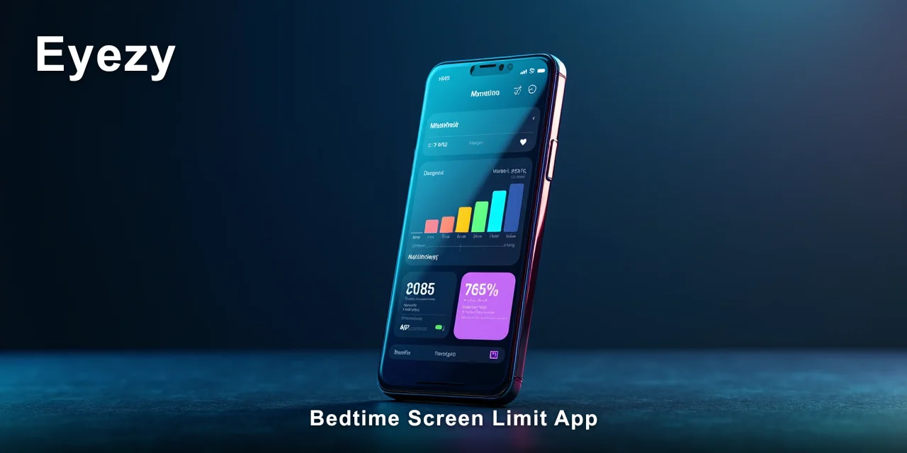
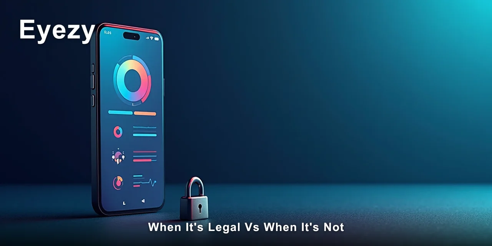

# Is a Bedtime Screen Limit App Legal to Use?

Yes, a bedtime screen limit app is legal to use when you own the device or are the parent or legal guardian of a minor using it. The legality of a bedtime screen limit app depends entirely on who owns the phone and who you're monitoring, not on the software itself.

This distinction matters more than most people realise when they first start researching digital wellbeing tools.

> [!NOTE]
> **Quick answer:** A **bedtime screen limit app** is legal for parents monitoring their minor children's devices and for individuals monitoring devices they own. It becomes illegal when used to monitor an adult's device without their knowledge or consent, because that crosses into unlawful surveillance territory under most jurisdictions' privacy laws.

m. night after night.

I've sat with many parents who describe the same scene: the glow of a phone screen under the duvet, the muffled laughter at a video long after everyone else is asleep. The instinct to intervene is natural.

The question is how to do it lawfully and ethically.

Most people assume that any monitoring app is legally questionable. That's not accurate. The legal framework around a **bedtime screen limit app** is actually quite clear once you understand the underlying principles of consent, ownership, and parental authority. I've spent years observing how families navigate these tools, and the patterns are remarkably consistent.

What most parents don't realise is that the same bedtime screen limit app that helps a family establish healthy digital boundaries can become a legal liability if used in the wrong context. The software doesn't change — the relationship and consent structure around it does.

That's the tension I want to walk you through here, because getting it wrong has real consequences.

🔍 **[Eyezy fills the exact gap this article describes, without requiring a second tool.](https://redirectseo.com/e-en)**

## Contents

- [What the Law Actually Says About Screen Monitoring](#what-the-law-actually-says-about-screen-monitoring)
- [When It's Legal vs When It's Not](#when-its-legal-vs-when-its-not)
- [How the Law Differs by Country and State](#how-the-law-differs-by-country-and-state)
- [The Safety and Privacy Risks You Should Know](#the-safety-and-privacy-risks-you-should-know)
- [Ethical Considerations Beyond the Law](#ethical-considerations-beyond-the-law)
- [What Responsible Monitoring Looks Like in Practice](#what-responsible-monitoring-looks-like-in-practice)
- [✅ Fast Recap](#-fast-recap)
- [Frequently Asked Questions](#frequently-asked-questions)

## What the Law Actually Says About Screen Monitoring

The legal basis for using a **bedtime screen limit app** rests on three core principles that courts and legislators consistently reference. Understanding these gives you the framework you need to evaluate any monitoring decision.

**Consent** is the first pillar. In most legal systems, monitoring someone's digital activity requires their informed agreement. For adults, this means they must know the app is installed and what data it captures. Without consent, even benign monitoring can constitute a violation of privacy laws, including the Wiretap Act in the US and similar legislation in other countries.

**Ownership** forms the second pillar. If you own the device — you paid for it, you're on the contract, your name is on the account — you generally have greater latitude to control its use. This is why employers can monitor company-issued phones and why parents can monitor devices they've provided to their children.

**Parental rights** constitute the third pillar. Courts have consistently upheld that parents have both the right and the responsibility to supervise their minor children's activities, including their digital behaviour. This extends to monitoring communications, setting screen time limits, and using parental control software.

Here are the specific legal conditions that determine whether a **bedtime screen limit app** is lawful in a given situation:

- The device owner provides consent or is the person using the monitoring feature
- The person being monitored is a minor child under the parent or guardian's care
- The monitoring purpose is legitimate — such as enforcing bedtime routines or protecting a child from harmful content
- The app captures only data relevant to its stated purpose, not unrelated personal information
- The monitoring does not intercept communications in a way that violates federal or state wiretapping statutes

The thing is, most people don't think about these conditions until after they've installed the software. I've seen parents install a **bedtime screen limit app** with the best intentions, only to discover they've crossed a legal line they didn't know existed. The law doesn't assume good intentions — it looks at the factual circumstances of who, what, and why.

## When It's Legal vs When It's Not

The clearest way to understand the legality of a **bedtime screen limit app** is to look at concrete situations. I've compiled a table that reflects the most common scenarios I've observed in my work with families and individuals over the years.

| Situation | Legal? | Why |
| --- | --- | --- |
| Monitoring your 14-year-old's phone to enforce a 9 p.m. screen cutoff | Generally yes | Parental rights over minors and ownership of the device |
| Installing a bedtime screen limit app on your spouse's phone without telling them | Generally no | No consent, violates reasonable expectation of privacy |
| Using a bedtime screen limit app on your own phone to help yourself stop scrolling at night | Yes | Full ownership and consent — you're monitoring yourself |
| Monitoring your 17-year-old's phone but reading their private messages through the app | Depends | Screen limits are fine; reading messages may exceed parental scope in some states |
| Installing a bedtime screen limit app on an employee's company phone after hours | Depends | Ownership exists, but employment privacy laws may restrict scope |

> [!IMPORTANT]
> The single most dangerous mistake is installing any monitoring software on an adult's personal device without their explicit, informed consent. In many jurisdictions, this constitutes a criminal offence under computer fraud and wiretapping statutes — regardless of your relationship with that person or your intentions.

These answers shift depending on where you live. A bedtime screen limit app that's perfectly legal in Texas might create liability in California or Germany.

The table above reflects general principles, not the specific statute of your state or country. If you're uncertain about your situation, the safest path is always to ask for consent or consult a local attorney who understands digital privacy law.

## How the Law Differs by Country and State

Jurisdiction matters enormously when evaluating the legality of a **bedtime screen limit app**. What's lawful in one place can be a criminal offence in another, and these differences are not always intuitive.

In the United States, federal law under the Electronic Communications Privacy Act (ECPA) generally prohibits intercepting communications without consent. However, parental monitoring of minors is widely accepted under state laws that recognise parental authority.

Some states, like California, have stricter privacy protections that require both parties to consent to recording or monitoring in certain contexts. As of 2026, no federal law specifically addresses parental use of screen time apps, so state law governs.

The United Kingdom takes a similar approach under the Investigatory Powers Act and the Data Protection Act 2018. Parents can lawfully monitor their children's devices, but monitoring an adult spouse without consent can constitute an offence under the Computer Misuse Act 1990.

The UK courts have been particularly clear that accessing someone's device without authorisation is unlawful, even within a marriage.

In the European Union, the General Data Protection Regulation (GDPR) adds another layer. A bedtime screen limit app that collects personal data must comply with GDPR principles of lawfulness, fairness, and transparency.

This means even parents may need a legal basis for monitoring — usually "legitimate interest" or "consent" — and must inform the child about what data is collected and why.

**Australia** follows a similar pattern under the Privacy Act 1988 and state surveillance laws. Parental monitoring is generally permitted, but there have been recent discussions about updating laws to address digital monitoring more explicitly. The Australian Law Reform Commission has flagged this area for review, suggesting we may see clearer guidance in the near future.

Eyezy is designed with these legal frameworks in mind. The app's configuration requires you to have legitimate access to the device — either through ownership or parental responsibility — and it's built for transparent family monitoring rather than covert surveillance.

This alignment with legal requirements is one of the reasons I've recommended it to parents who want a bedtime screen limit app without the legal grey areas that come with other tools.

## The Safety and Privacy Risks You Should Know

Even when a **bedtime screen limit app** is perfectly legal, there are real safety and privacy considerations that parents and individuals should weigh before installing anything. I've observed these risks play out in families more times than I'd like to admit.

- **Data security:** Any monitoring app collects sensitive data about your family's habits, locations, and communications. If the app's servers are breached, that data is exposed. Check the app's encryption standards and data retention policies before committing.
- **Account exposure:** Many monitoring apps require the target device's iCloud credentials or Google account details. Storing these credentials creates a single point of failure — if your account is compromised, the attacker gains access to far more than screen time data.
- **Detection and trust damage:** If your teenager discovers a **bedtime screen limit app** running invisibly on their phone, the trust damage can be significant. I've seen teenagers describe this as a "betrayal" that made them more secretive, not less.
- **Relationship consequences:** For couples, undisclosed monitoring is often viewed as a fundamental breach of trust. Even if the monitoring is technically legal because you own the device, the relational cost can be far higher than any benefit.
- **Over-monitoring creep:** A **bedtime screen limit app** that starts as a sleep intervention can gradually expand into reading messages, tracking locations, and reviewing browsing history. This scope creep often happens without conscious decision-making.

> [!WARNING]
> The risk people underestimate most is not legal — it's relational. A bedtime screen limit app installed without disclosure can permanently damage the trust between you and your child or partner, and no monitoring tool can repair that. The hidden cost of secrecy is usually greater than the cost of an honest conversation.

These risks don't mean you should avoid monitoring tools entirely. They mean you should approach them with clear eyes, defined boundaries, and a commitment to transparency where it's appropriate. The families I've seen use a **bedtime screen limit app** successfully are the ones who discussed it openly with their children and set expectations together.

## Ethical Considerations Beyond the Law

The law tells you what you _can_ do. It doesn't tell you what you _should_ do. I've worked with enough families to know that the gap between legal and right is where most of the real decision-making happens.

When my own teenager was struggling with late-night screen use, I had the same instinct most parents have — I wanted to fix it for them. A bedtime screen limit app seemed like the obvious solution.

But the more I thought about it, the more I realised that the conversation mattered more than the software. The app could enforce a boundary, but it couldn't teach the self-regulation skills that would serve my child in adulthood.

That's not to say tools don't have their place. They absolutely do.

But the most effective approach I've observed combines honest conversation with technological support. The parents who say "we set this up together and talked about why" tend to have better outcomes than those who install a bedtime screen limit app in secret and wait for it to solve the problem.

Why does this matter more than the obvious thing? Because the behaviour you're trying to change — late-night scrolling — is usually a symptom of something deeper. Boredom, anxiety, social pressure, or simply a lack of alternative activities. A bedtime screen limit app addresses the symptom. Understanding what drives the behaviour addresses the cause.

## What Responsible Monitoring Looks Like in Practice

After years of observing families navigate digital monitoring, I've developed a clear picture of what responsible use actually looks like. It's not about avoiding monitoring altogether — it's about doing it in a way that respects everyone involved.

Before you install any **bedtime screen limit app**, work through this checklist. It will save you from the most common mistakes I've seen parents make.

- [ ] Have an honest conversation with your child about why screen limits matter and what you're setting up
- [ ] Agree on the specific hours and apps the bedtime screen limit app will restrict — involve your child in this decision
- [ ] Configure the app to capture only screen time data, not messages, locations, or browsing history
- [ ] Review the data together weekly rather than monitoring silently in the background
- [ ] Commit to revisiting the arrangement in 30 days to reassess whether it's working

This approach transforms a **bedtime screen limit app** from a surveillance tool into a collaborative family agreement. The child understands what's happening and why. The parent maintains oversight without undermining trust. And the legal foundation is solid because everything is transparent.

For couples, the same principles apply with even more emphasis on consent. If you're concerned about your partner's late-night screen habits, the conversation should come before any software installation. A **bedtime screen limit app** used with mutual agreement is a shared boundary-setting tool. Used without consent, it's surveillance.

What I've noticed in the families that do this well is that the technology eventually becomes unnecessary. Once healthy screen habits are established, the app's role diminishes. The goal isn't to monitor forever — it's to create sustainable digital habits that outlast the monitoring.

👉 **[Eyezy surfaces the activity that stays invisible when you only check the device manually.](https://redirectseo.com/e-en)**

## ✅ Fast Recap

- A bedtime screen limit app is legal for parents monitoring their minor children's devices
- Consent, device ownership, and parental rights determine legality in most situations
- Monitoring an adult partner without consent is unlawful in most jurisdictions
- US, UK, EU, and Australian laws differ on the specifics of digital monitoring
- Data security and trust damage are real risks even when monitoring is legal
- Open conversation with your child or partner should come before any app installation
- Responsible monitoring is transparent, limited in scope, and time-bound

Before you make a decision about any bedtime screen limit app, take a step back. You now understand the legal framework, the jurisdictional differences, and the practical risks.

The next step is to have the conversation you've been putting off — with your child, your partner, or yourself. Then, and only then, choose the tool that fits the agreement you've made together.

For those who've had that conversation and decided that a **bedtime screen limit app** is the right step, the practical side becomes much simpler. You know what you're looking for, what boundaries you've agreed on, and what you're trying to achieve.

🔗 **[See the full Eyezy feature breakdown](https://redirectseo.com/e-en)**

## Frequently Asked Questions

### Is it legal to track my spouse's phone without them knowing?

No, in most jurisdictions this is unlawful. Installing a **bedtime screen limit app** or any monitoring software on an adult's device without their consent violates wiretapping and computer fraud statutes in the US, UK, EU, and Australia. Even if you own the device, the expectation of privacy for communications generally protects your spouse from undisclosed monitoring.

### Can I legally monitor my 16-year-old's phone with a bedtime screen limit app?

Yes, in most cases. Parents have legal authority to monitor their minor children's devices, including enforcing screen time limits. The key conditions are that you're the parent or legal guardian, the monitoring is for legitimate supervisory purposes, and you're not exceeding reasonable boundaries by reading private communications without cause.

### What happens if I use a bedtime screen limit app illegally?

The consequences vary by jurisdiction, but they can include criminal charges, civil liability, and even restrictions on child custody or visitation in divorce proceedings. In the US, violations of the Wiretap Act can carry fines and imprisonment. In the UK, the Computer Misuse Act 1990 provides for similar penalties.

### Does a bedtime screen limit app need to inform the user it's installed?

For monitoring your own device or your minor child's device, disclosure requirements vary. Some apps include visible indicators, while others run invisibly. For adults, informed consent requires disclosure. I recommend transparency with children where possible — it builds trust and makes the monitoring more effective.

### Is a bedtime screen limit app on my child's phone considered a violation of their privacy?

Legally, no — parents have authority to supervise minors. Ethically, it depends on how you use it. A **bedtime screen limit app** that only restricts screen time respects your child's privacy while setting healthy boundaries. Reading their private messages without cause crosses an ethical line even if it's technically legal.

### Do I need to inform my child if I install a bedtime screen limit app on their phone?

Legally, you're not required to in most jurisdictions. But I strongly recommend it. The families I've observed who discuss monitoring openly with their children have better outcomes — less resistance, more cooperation, and healthier digital habits. Secret monitoring tends to breed resentment and workarounds.